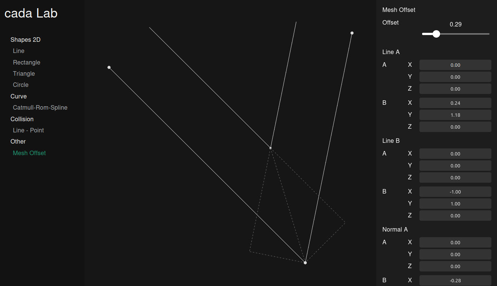

# [Cada Lab](https://vgerber.github.io/cada-lab)

Write interactive sketches to play with geometry related algorithms (in nextjs + typescript)



## Getting Started

```bash
npm i
npm run dev
```

And visit `localhost:3000`. You will be automatically redirected to the default sketch from your local [.env](.env) file

The project is intended to be used as static export.

## Adding a sketch

To add a new sketch, simply copy a sketch from [sketches](src/app/components/sketches/) like a [simple line](src/app/components/sketches/shape/2d/line.tsx). And create a new react component

```tsx
export default function LineShape2d() {
  return <SketchBook sketch={setupSketch()} />;
}

function setupSketch(): Sketch {
  const line = new Line(
    "Line 1",
    new THREE.Vector3(0, 0, 0),
    new THREE.Vector3(1, 1, 0),
  );
  const lineADrag = new DragPoint(
    line,
    (l) => l.a,
    (l, position) =>
      runInAction(() => (l.a = new THREE.Vector3(position.x, position.y, 0))),
  );
  const lineBDrag = new DragPoint(
    line,
    (l) => l.b,
    (l, position) =>
      runInAction(() => (l.b = new THREE.Vector3(position.x, position.y, 0))),
  );
  const sketchLine = new SketchShape(line, [lineADrag, lineBDrag]);
  return new Sketch([sketchLine]);
}
```

Then register the new sketch in the [registry](src/app/components/sketches/registered_sketches.tsx)

```tsx
export const registeredSketches: Record<string, SketchRegistrationGroup> = {
  "shapes/2d": {
    name: "Shapes 2D",
    registrations: {
      line: {
        name: "Line",
        component: <LineShape2d />,
      },
    },
  },
};
```

With `npm run dev` the new sketch should be listed in the sidebar.
